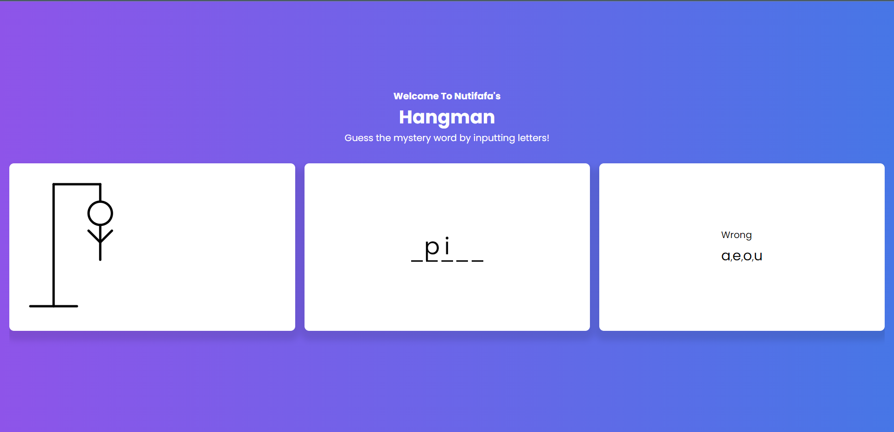

# Hangman With JavaScript
This is a game of hangman with visual implementations created with CSS and functionality with JS. 
I actually really enjoyed this project because it was a lot of fun to create and it was a great way to practice my JavaScript skills. It tooks me about 4 hours to create this project. 

## Links
- Check the live version of the game [here](https://nutifafas-hangman.netlify.app/).

## References
- [My Hangman Game In Python](https://github.com/neophyte-programmer/hangman-with-python)

## Instructions
- Load the page
- Press the letters to guess the word

## What I Learned
- How to manipulate the DOM
- I actually learn how to import and export stuff again

## Things To Do
- Add a timer
- Make it responsive for mobile
- 

## How It Looks

  